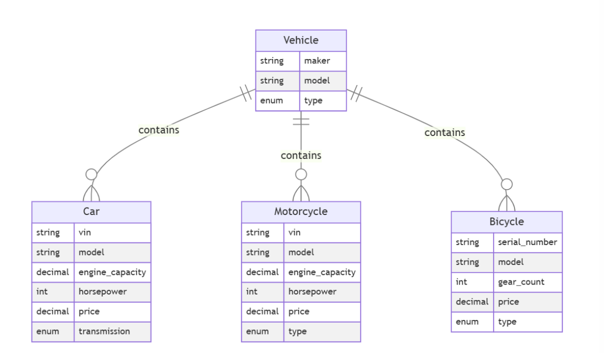
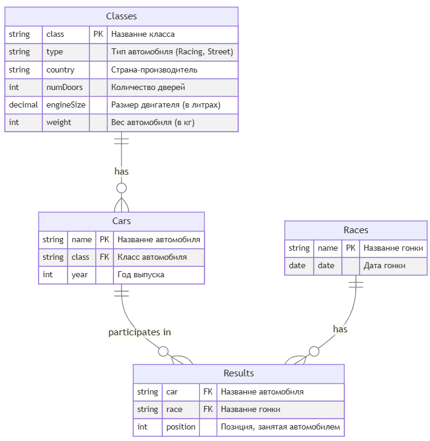
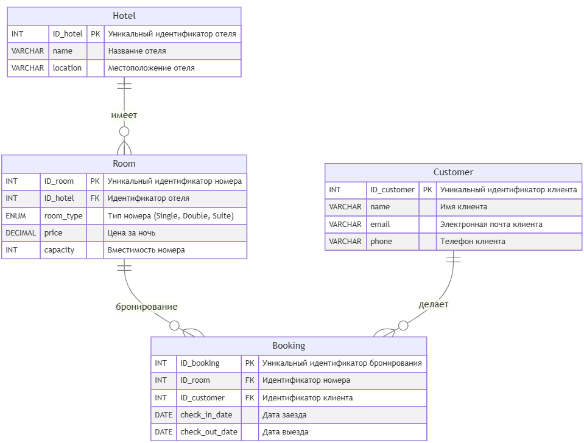

# db-2024-2025-2

Домашняя работа по дисциплине "Базы данных". 2-й семестр 1-го курса МИФИ ИИКС РПО (2024-2025 уч.г).

## Введение

Цель данного проекта - повторение основы работы с базами данных с помощью SQL. Задание предусматривает создание, наполнение и манипуляцию с данными в четырех базах данных:

- Транспортные средства.
- Автомобильные гонки.
- Бронирование отелей.
- Структура организации.

Каждая база данных сопровождается скриптами, которые упрощают процесс создания таблиц, а также заполняют их тестовыми данными.

**Важный момент**: в `README.md` будут приведены только условия заданий, но в скриптах-решениях будут находиться комментарии, поясняющие запрос.

## Инструкция по запуску

Учитывая, что мы имеем дело с 4-мя независимыми базами данных, было принято решение разделить их по папкам. В корне репозитория находится 4 папки, соответственно относящиеся к перечисленным выше базам данных:

- `1-vehicles`
- `2-races`
- `3-hotels`
- `4-organization`

Внутри каждой папки также находится две папки:

- `init` содержит `docker-compose.yml` файл для запуска базы данных, а также папку `script`, в которой лежит скрипт создания базы и наполнения ее тестовыми данными.
- `tasks` содержит непосредственно код заданий, то есть соответствующих SQL запросов.

Следовательно, для того, чтобы проверить работу конкретной базы данных достаточно иметь в системе установленный `Docker`. Алгоритм действий будет выглядеть следующим образом:

1. Перейти в папку `init` в папке нужной базы данных.
2. Написать в терминале команду `docker compose up -d` - база данных запустится в докере в фоновом режиме, а также автоматически применит скрипт инициализации.
3. Проверить работу запросов из папки `task`.
4. Завершить работу базы командой `docker compose down`.
5. Аналогичным образом проверить остальные базы данных.

## База данных 1 - Транспортные средства

### Описание

База данных "Транспортные средства" включает в себя четыре таблицы: `Vehicle`, `Car`, `Motorcycle` и `Bicycle`.

- `Vehicle`: Основная таблица, содержащая информацию о типе и модели транспортного средства. Тип может быть автомобилем, мотоциклом или велосипедом.
- `Car`: Таблица для автомобилей с характеристиками, такими как объем двигателя, мощность, цена и тип трансмиссии.
- `Motorcycle`: Таблица для мотоциклов, содержащая данные о мощности, объеме двигателя, цене и типе мотоцикла.
- `Bicycle`: Таблица для велосипедов, включающая информацию о количестве передач и типе велосипеда.

### Задачи

#### Задача 1

Найдите производителей (maker) и модели всех мотоциклов, которые имеют мощность более 150 лошадиных сил, стоят менее 20 тысяч долларов и являются спортивными (тип Sport). Также отсортируйте результаты по мощности в порядке убывания.

Решение задачи должно представлять из себя один SQL-запрос.

#### Задача 2

Найти информацию о производителях и моделях различных типов транспортных средств (автомобили, мотоциклы и велосипеды), которые соответствуют заданным критериям.

1. Автомобили:

Извлечь данные о всех автомобилях, которые имеют:

- Мощность двигателя более 150 лошадиных сил.
- Объем двигателя менее 3 литров.
- Цену менее 35 тысяч долларов.

В выводе должны быть указаны производитель (maker), номер модели (model), мощность (horsepower), объем двигателя (engine_capacity) и тип транспортного средства, который будет обозначен как Car.

2. Мотоциклы:

Извлечь данные о всех мотоциклах, которые имеют:

- Мощность двигателя более 150 лошадиных сил.
- Объем двигателя менее 1,5 литров.
- Цену менее 20 тысяч долларов.

В выводе должны быть указаны производитель (maker), номер модели (model), мощность (horsepower), объем двигателя (engine_capacity) и тип транспортного средства, который будет обозначен как Motorcycle.

3. Велосипеды:

Извлечь данные обо всех велосипедах, которые имеют:

- Количество передач больше 18.
- Цену менее 4 тысяч долларов.
- В выводе должны быть указаны производитель (maker), номер модели (model), а также NULL для мощности и объема двигателя, так как эти характеристики не применимы для велосипедов. Тип транспортного средства будет обозначен как Bicycle.

4. Сортировка:

Результаты должны быть объединены в один набор данных и отсортированы по мощности в порядке убывания. Для велосипедов, у которых нет значения мощности, они будут располагаться внизу списка.

Решение задачи должно представлять из себя один SQL-запрос.

## База данных 2 - Автомобильные гонки

### Описание

База данных "Автомобильные гонки" включает в себя четыре таблицы: `Classes`, `Cars`, `Races` и `Results`.

- `Classes`: Здесь хранятся данные о категориях автомобилей, включая тип (гоночный или уличный), страну-производителя, количество дверей, размер двигателя и вес автомобиля.
- `Cars`: Содержит информацию об автомобилях, участвующих в гонках, такие как название, класс и год выпуска.
- `Races`: В этой таблице записаны названия и даты проведения гонок.
- `Results`: Содержит результаты выступлений автомобилей в гонках, включая название автомобиля, название гонки и занятое место.

### Задачи

#### Задача 1

Определить, какие автомобили из каждого класса имеют наименьшую среднюю позицию в гонках, и вывести информацию о каждом таком автомобиле для данного класса, включая его класс, среднюю позицию и количество гонок, в которых он участвовал. Также отсортировать результаты по средней позиции.

Решение задачи должно представлять из себя один SQL-запрос.

#### Задача 2

Определить автомобиль, который имеет наименьшую среднюю позицию в гонках среди всех автомобилей, и вывести информацию об этом автомобиле, включая его класс, среднюю позицию, количество гонок, в которых он участвовал, и страну производства класса автомобиля. Если несколько автомобилей имеют одинаковую наименьшую среднюю позицию, выбрать один из них по алфавиту (по имени автомобиля).

Решение задачи должно представлять из себя один SQL-запрос.

#### Задача 3

Определить классы автомобилей, которые имеют наименьшую среднюю позицию в гонках, и вывести информацию о каждом автомобиле из этих классов, включая его имя, среднюю позицию, количество гонок, в которых он участвовал, страну производства класса автомобиля, а также общее количество гонок, в которых участвовали автомобили этих классов. Если несколько классов имеют одинаковую среднюю позицию, выбрать все из них.

Решение задачи должно представлять из себя один SQL-запрос.

#### Задача 4

Определить, какие автомобили имеют среднюю позицию лучше (меньше) средней позиции всех автомобилей в своем классе (то есть автомобилей в классе должно быть минимум два, чтобы выбрать один из них). Вывести информацию об этих автомобилях, включая их имя, класс, среднюю позицию, количество гонок, в которых они участвовали, и страну производства класса автомобиля. Также отсортировать результаты по классу и затем по средней позиции в порядке возрастания.

Решение задачи должно представлять из себя один SQL-запрос.

#### Задача 5

Определить, какие классы автомобилей имеют наибольшее количество автомобилей с низкой средней позицией (больше 3.0) и вывести информацию о каждом автомобиле из этих классов, включая его имя, класс, среднюю позицию, количество гонок, в которых он участвовал, страну производства класса автомобиля, а также общее количество гонок для каждого класса. Отсортировать результаты по количеству автомобилей с низкой средней позицией.

Решение задачи должно представлять из себя один SQL-запрос.

## База данных 3 - Бронирование отелей

### Описание

База данных "Бронирование отелей" включает в себя четыре таблицы: `Hotel`, `Room`, `Customer` и `Booking`.

- `Hotel`: Содержит информацию об отелях, включая их уникальный идентификатор, название и местоположение.
- `Room`: Учитывает комнаты в отелях, указывая на отель, тип комнаты (одноместный, двухместный, люкс), цену и вместимость.
- `Customer`: Содержит данные о клиентах, включая уникальный идентификатор, имя, адрес электронной почты и номер телефона.
- `Booking`: Записи о бронированиях, связывающие клиента и комнату в отеле, с указанием даты заезда и выезда.

### Задачи

#### Задача 1

Определить, какие клиенты сделали более двух бронирований в разных отелях, и вывести информацию о каждом таком клиенте, включая его имя, электронную почту, телефон, общее количество бронирований, а также список отелей, в которых они бронировали номера (объединенные в одно поле через запятую с помощью CONCAT). Также подсчитать среднюю длительность их пребывания (в днях) по всем бронированиям. Отсортировать результаты по количеству бронирований в порядке убывания.

Решение задачи должно представлять из себя один SQL-запрос.

#### Задача 2

Необходимо провести анализ клиентов, которые сделали более двух бронирований в разных отелях и потратили более 500 долларов на свои бронирования. Для этого:

- Определить клиентов, которые сделали более двух бронирований и забронировали номера в более чем одном отеле. Вывести для каждого такого клиента следующие данные: ID_customer, имя, общее количество бронирований, общее количество уникальных отелей, в которых они бронировали номера, и общую сумму, потраченную на бронирования.
- Также определить клиентов, которые потратили более 500 долларов на бронирования, и вывести для них ID_customer, имя, общую сумму, потраченную на бронирования, и общее количество бронирований.
- В результате объединить данные из первых двух пунктов, чтобы получить список клиентов, которые соответствуют условиям обоих запросов. Отобразить поля: ID_customer, имя, общее количество бронирований, общую сумму, потраченную на бронирования, и общее количество уникальных отелей.
- Результаты отсортировать по общей сумме, потраченной клиентами, в порядке возрастания.

Решение задачи должно представлять из себя один SQL-запрос.

#### Задача 3

Вам необходимо провести анализ данных о бронированиях в отелях и определить предпочтения клиентов по типу отелей. Для этого выполните следующие шаги:

3. Категоризация отелей.

Определите категорию каждого отеля на основе средней стоимости номера:

- «Дешевый»: средняя стоимость менее 175 долларов.
- «Средний»: средняя стоимость от 175 до 300 долларов.
- «Дорогой»: средняя стоимость более 300 долларов.

2. Анализ предпочтений клиентов.

Для каждого клиента определите предпочитаемый тип отеля на основании условия ниже:

- Если у клиента есть хотя бы один «дорогой» отель, присвойте ему категорию «дорогой».
- Если у клиента нет «дорогих» отелей, но есть хотя бы один «средний», присвойте ему категорию «средний».
- Если у клиента нет «дорогих» и «средних» отелей, но есть «дешевые», присвойте ему категорию предпочитаемых отелей «дешевый».

3. Вывод информации.

Выведите для каждого клиента следующую информацию:

- ID_customer: уникальный идентификатор клиента.
- name: имя клиента.
- preferred_hotel_type: предпочитаемый тип отеля.
- visited_hotels: список уникальных отелей, которые посетил клиент.

4. Сортировка результатов.

Отсортируйте клиентов так, чтобы сначала шли клиенты с «дешевыми» отелями, затем со «средними» и в конце — с «дорогими».

Решение задачи должно представлять из себя один SQL-запрос.